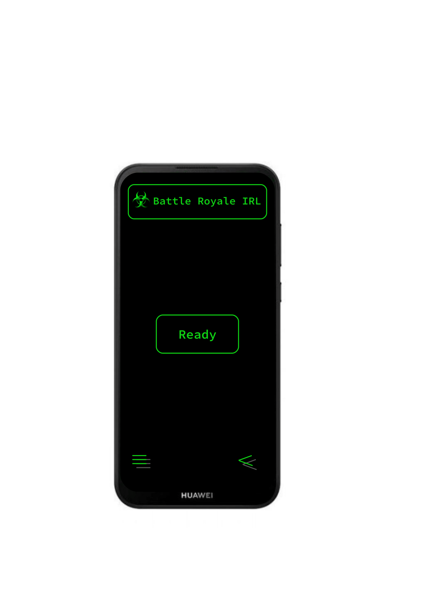
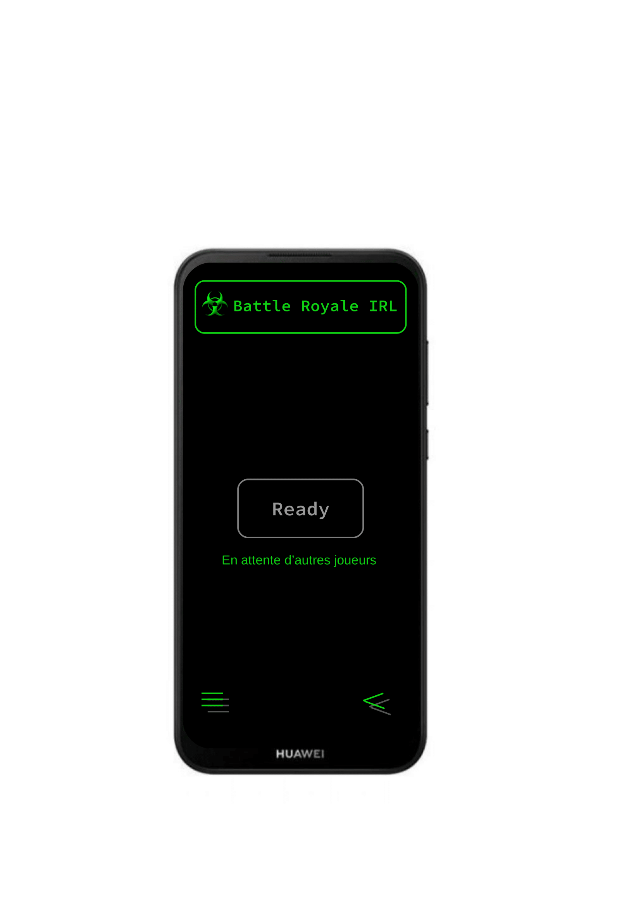
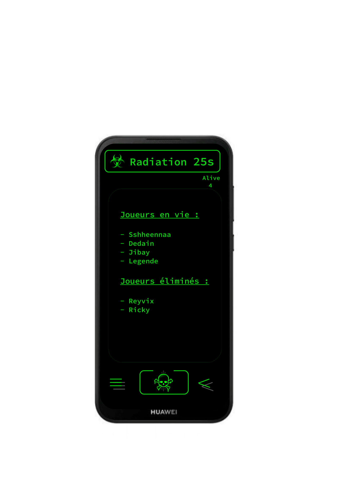
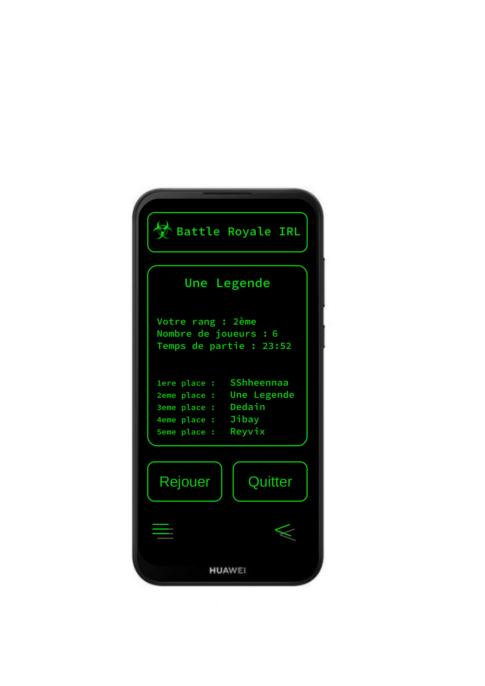
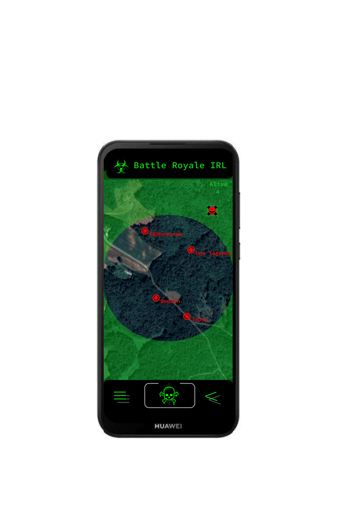

# BRI - Battle Royale IRL

This app intends to provide an airsoft management system for emulating [battle royale games](https://en.wikipedia.org/wiki/Battle_royale_game) in real life.

## Overview

So you have an airsoft field, and you want to play one against all just like <INSERT_BATTLE_ROLAYLE_VIDEOGAME_NAME_HERE>. However, there lies a problem, especially when your choosen map is large. The less players there are, the less probable they will meet and fight.

This app solves the above problem by providing each player with a live map and a zone narrowing with time which kills players standing outside for too long.

| | | |
|:-------------------------:|:-------------------------:|:-------------------------:|
| |  ||
|  |  ||

### Running the app

#### Satisfy dependencies
```
npm install
```

You are required to set up in a .env :
- a firebase API key
- a google map API key
- the admin authorization password

#### Start the game server

```
npm run start
```

## Feedback
If you have used and enjoy this code base, I'd love to hear from you!

